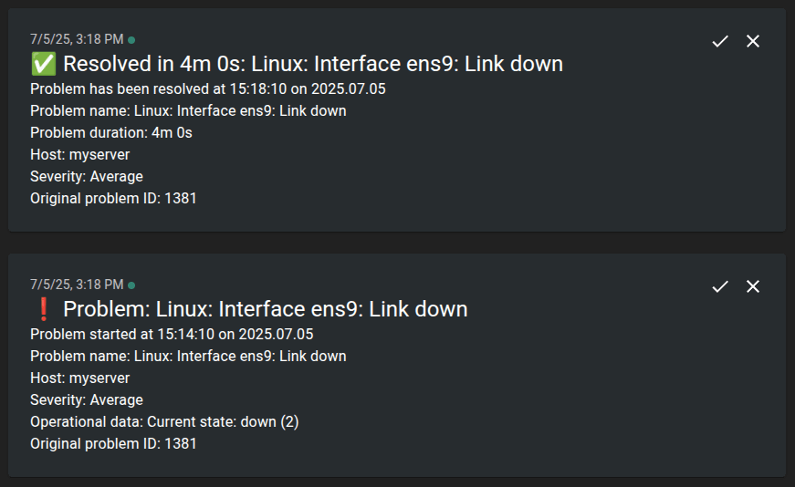

# Zabbix ntfy

**Zabbix ntfy** is a media type to send Zabbix notifications to a custom ntfy topic.  
Maps `{EVENT.SEVERITY}` to ntfy priority, applies emoji tags, supports authentication, and HTTP Proxy.

## Features

- Sends notifications to a custom ntfy topic, using public or self-hosted server.
- Supports token or username and password authentication.
- Supports HTTP Proxy.
- Maps Zabbix `{EVENT.SEVERITY}` to ntfy priority (1–5).
- Adds ntfy emoji tags according to severity.
- Resolved issue notifications start with a green checkmark emoji (✅) for clarity.
- Does not log any data, ensuring that sensitive information such as the token, username, and password is never written to logs.

## Severity and priority mappings explained

| Zabbix Severity  | ntfy Priority | Icon | Emoji | Description |
|------------------|---------------|------|--------|-------------|
| Not classified   | 1             |  | ❔     | No vibration or sound. Notification will be under the fold in "Other notifications". |
| Information      | 2             |  | ❕     | No vibration or sound. Notification will not visibly show up until notification drawer is pulled down. |
| Warning          | 3             | –    | ⚠️     | Short default vibration and sound. Default notification behavior. |
| Average          | 3             | –    | ❗     | Short default vibration and sound. Default notification behavior. |
| High             | 4             |  | ‼️     | Long vibration burst, default notification sound with a pop-over notification. |
| Disaster         | 5             |  | 🚨     | Really long vibration bursts, default notification sound with a pop-over notification. |

## Screenshot

Example of an Average-level notification in ntfy:

## Installation

1. **Download and install ntfy media type**:

    Download [ntfy.yaml](ntfy.yaml) and import it in Zabbix: Alerts > Media types > **Import**.  
    **Choose file**, and click **Import** and **Apply**.

## Configuration

1. **Configure Media Type**

   If you're using ntfy's free public server, no changes are needed.

   If you're using a **Pro plan** or a **self-hosted ntfy instance**, click on the media type to configure the following fields:

   - **Token** or **Username** and **Password**: Used for authentication. Only one method is required.
   - **URL**: Set this if you're using a self-hosted ntfy server. Otherwise, leave it as is.
   - **HTTPProxy**: If your Zabbix server requires outbound HTTP requests to go through a proxy, enter it here, or leave blank if not needed.  
     Format: `http://proxy.example.com:8080`.

2. **Enable notifications for user**:

    Go to Users > Users > Username (e.g. Admin) > Media and click **Add**.  
    Set the following criteria:

    - **Type**: ntfy
    - **Send to**: Your ntfy topic

    Click **Add** and **Update**.

3. **Configure Conditions for Notifications**:

    Go to Alerts > Actions > Trigger actions > “Report problems to Zabbix administrators” and click **Add**.  
    Set the following criteria:

    - **Type**: Trigger severity
    - **Operator**: is greater than or equals
    - **Severity**: Warning (or desired severity level)

    Click **Add** and **Update**.

## Test Media Type

Go to Alerts > Media types > click **Test** in the ntfy column, and fill out:

- **Message**: This is a disaster message!
- **Severity**: Disaster
- **Subject**: Danger
- **To**: Your ntfy topic

If using authentication, fill out **Token**, or **Username** and **Password**, then click **Test**.

## Author

**Paul Sørensen**  
[https://paulsorensen.io](https://paulsorensen.io)  
[https://github.com/paulsorensen](https://github.com/paulsorensen)

## Support

If you found this project useful, a small tip is appreciated ❤️  
[https://buymeacoffee.com/paulsorensen](https://buymeacoffee.com/paulsorensen)

## License

This project is licensed under the MIT License.  
See [LICENSE](LICENSE) for details.

Priority icons and their descriptions are sourced from [ntfy.sh](https://ntfy.sh) and used under the Apache License 2.0.
